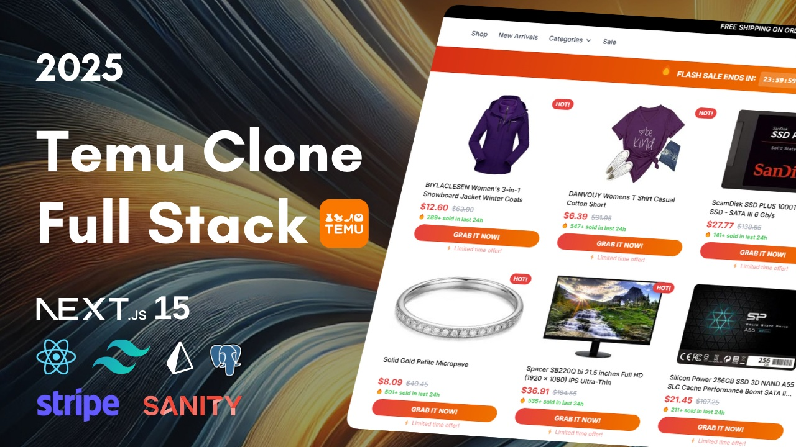

# 🛍️ TEMU Clone | Modern E-Commerce Platform
[](https://www.youtube.com/watch?v=-_-kvPiMybw)

A full-stack e-commerce platform built with NextJS 15 and React 19, inspired by TEMU's design. This project demonstrates modern web development practices and an end-to-end e-commerce experience.

[](https://choosealicense.com/licenses/mit/)
[](https://nextjs.org/)
[](https://react.dev/)
[](https://www.typescriptlang.org/)
[](https://www.prisma.io/)

## 🌟 Features

- 🚀 Built with Next.js 15 and React 19
- 💎 Type-safe development with TypeScript
- 🎨 Design with TailwindCSS
- 🗄️ PostgreSQL database with Prisma ORM
- 🔐 User authentication and authorization
- 🛒 Real-time product fetching for live updates
- 📊 Sanity Studio dashboard for product management
- ⚡ Optimized performance with server-side rendering

## 🚀 Quick Start

### Prerequisites
- npm or yarn
- Git

### Installation

1. Clone the repository
```bash
git clone https://github.com/danablend/public-nextjs-15-sanity-stripe-full-ecommerce-tutorial.git
cd public-nextjs-15-sanity-stripe-full-ecommerce-tutorial
```

2. Install dependencies
```bash
npm install
# or
yarn install
```

3. Set up environment variables
```bash
cp .env.example .env
```
Fill in your environment variables in the `.env` file:
```env
DATABASE_URL="postgresql://..."
# etc..
```

4. Set up the database
```bash
npx prisma db push
npx prisma generate
```

5. Run the development server
```bash
npm run dev
# or
yarn dev
```

Visit `http://localhost:3000` to see your application running.

## 🏗️ Tech Stack

- **Frontend**
  - Next.js 15
  - React 19
  - TypeScript
  - TailwindCSS

- **Backend**
  - Next.js Server Actions & API Endpoints
  - Prisma ORM
  - PostgreSQL

- **Deployment**
  - Vercel
  - PostgreSQL (Your preferred provider)

## 🛡️ License
This project is licensed under the MIT License - see the [LICENSE.md](LICENSE.md) file for details.

## 🙏 Acknowledgments
- Design inspired by TEMU
- [Next.js Documentation](https://nextjs.org/docs)
- [Prisma Documentation](https://www.prisma.io/docs)
- [TailwindCSS Documentation](https://tailwindcss.com/docs)

## 📝 Notes
This is a project built for educational purposes. It's not affiliated with TEMU.